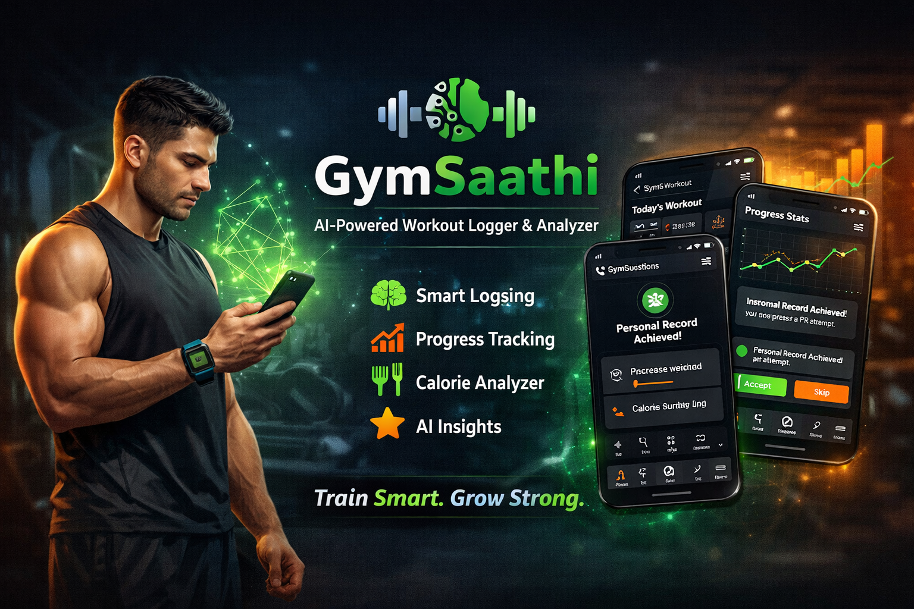
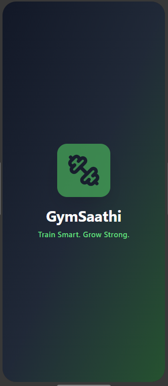
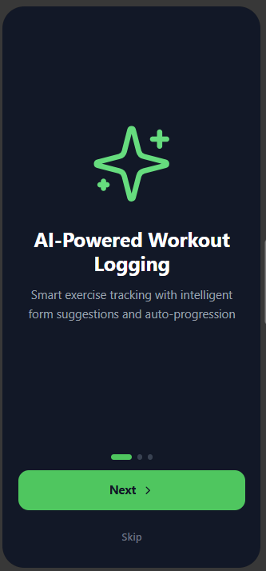
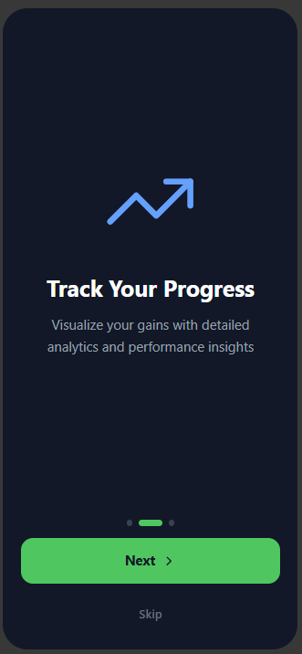
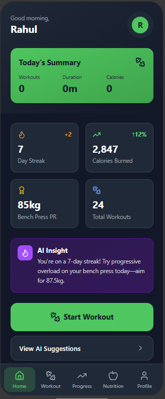
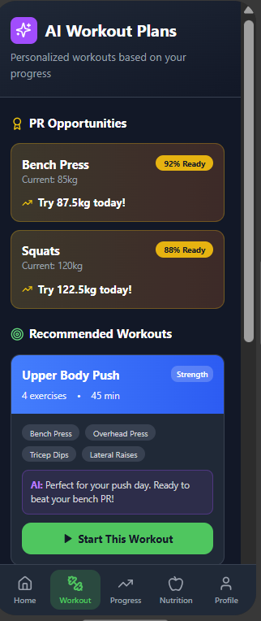
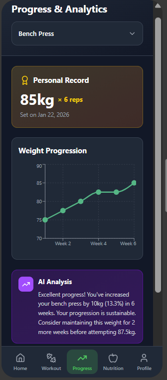
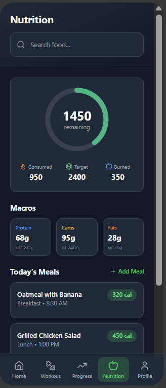
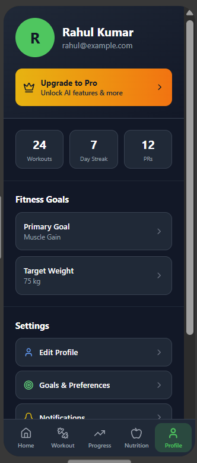

# 🏋️ GymSaathi — AI Workout Logger & Analyzer (Android)

  

**GymSaathi** is a production-oriented **Android fitness app** that uses **agentic AI** to intelligently log workouts, analyze progress, and deliver adaptive training insights.

🔗 **Figma UI (Full App Flow):**  
https://www.figma.com/make/wufemtm3e5dfcQphv8V2mg/AI-Workout-Logger

---

## 🚀 Why GymSaathi?

Most gym apps only record data.  
GymSaathi **observes → reasons → acts → learns**, making workouts smarter and more personalized.

---

## ✨ Key Features

| Category | Description |
|-------|------------|
| Agentic AI Logging | Auto-suggests sets, reps & weights |
| Progressive Overload | Adjusts training based on performance |
| Plateau Detection | Identifies stalled progress |
| Progress Analytics | Exercise-wise graphs & PR detection |
| AI Insights | Explains trends & recommends next steps |
| Calorie Analyzer | Meal & macro tracking *(planned)* |
| Subscriptions | Free vs Pro feature gating *(planned)* |

---
## 📱 App Screenshots

<table>
  <tr>
    <td align="center">
      
       <b>Splash Screen</b>
    </td>
    <td align="center">
      
       <b>Onboarding</b>
    </td>
    <td align="center">
      
       <b>AI Highlights</b>
    </td>
    <td align="center">
      
       <b>Home Dashboard</b>
    </td>
  </tr>

  <tr>
    <td align="center">
      
       <b>Workout Logging</b>
    </td>
    <td align="center">
      
       <b>Progress Analytics</b>
    </td>
    <td align="center">
      
       <b>Calorie Analyzer</b>
    </td>
    <td align="center">
      
       <b>Profile & Settings</b>
    </td>
  </tr>
</table>

## 🛠 Tech Stack

| Layer | Technologies |
|-----|--------------|
| Language | Kotlin |
| UI | XML, Material Design |
| Architecture | MVVM, Clean Architecture |
| Data | Room Database (offline-first) |
| AI | Rule-based engine, LLM-ready (OpenAI / Gemini) |
| Charts | MPAndroidChart |
| Auth | Firebase Auth (planned) |
| Payments | Google Play Billing (planned) |
| Design | Figma (interactive prototype) |

---

## 📈 Engineering Highlights
- Designed a **decision-making AI system** inside a mobile app  
- Built a **scalable, migration-safe architecture**  
- Separated feature access (payments) from feature behavior (AI)  
- Planned feature expansion without refactoring existing code  

---

## 🗺 Roadmap
- [x] Intelligent workout logging  
- [x] Progress analytics  
- [x] Agentic AI (rule-based)  
- [ ] LLM-powered insights  
- [ ] Calorie analyzer  
- [ ] Subscriptions & payments  

---

## 👨‍💻 Author
**Shivam Kumar** — B.Tech Student | Android Developer  
## 🤝 Get in Touch
🌐 https://shivamkumarptu.github.io/Business-Site/

